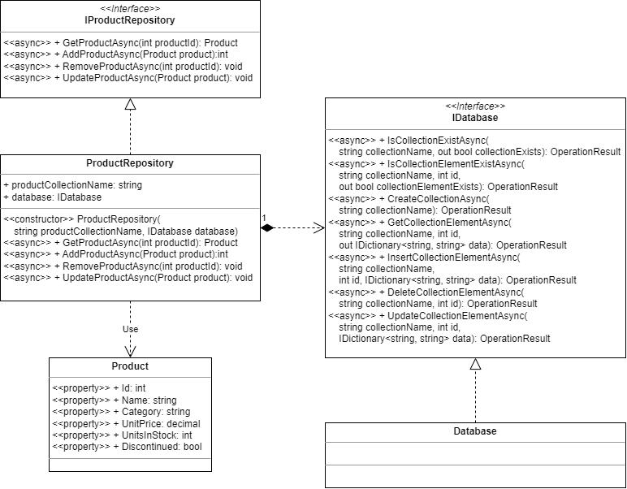
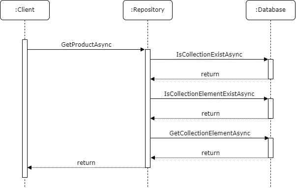
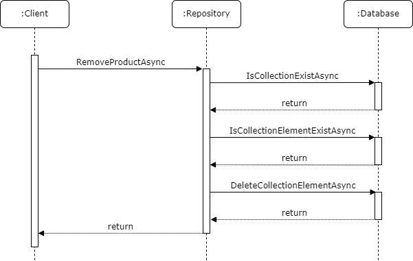
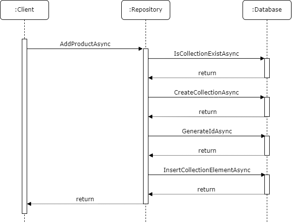
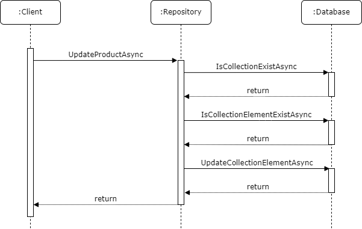

# Product Repository (Async)

Beginner level task for practicing asynchronous methods and the task-based asynchronous pattern (TAP).

Estimated time to complete the task - 1.5h.

The task requires .NET 8 SDK installed.


## Task Description

The `ProductRepository` class represents a product storage service and provides a set of methods for managing the list of products. The class uses the `IDatabase` interface, which represents a simple [document-oriented database](https://en.wikipedia.org/wiki/Document-oriented_database) for storing collections and collection elements (documents). The `Product` class represents a product and contains the product data.

Class diagram 1. The `ProductRepository` class.



In this task, you have to implement four methods of the `ProductRepository` class. The methods should be asynchronous and follow the [task-based asynchronous pattern](https://learn.microsoft.com/en-us/dotnet/standard/asynchronous-programming-patterns/task-based-asynchronous-pattern-tap).

* The `ProductRepository` class is the implementation of the [repository pattern](https://martinfowler.com/eaaCatalog/repository.html) that provides four basic operations of persistent storage: [create, read, update, and delete](https://en.wikipedia.org/wiki/Create,_read,_update_and_delete) (CRUD operations).
* The [constructor injection](https://freecontent.manning.com/understanding-constructor-injection/) technique is used to implement the [dependency injection](https://en.wikipedia.org/wiki/Dependency_injection) pattern in the `ProductRepository` class; the `IDatabase` dependency is injected as an argument of the class constructor.
* The methods of the `ProductRepository` class should throw exceptions in the case of issues. See the comment documentation for exception classes in the code files.
* The `IDatabase` interface contains a set of methods to manage collections and collection elements. The `Database` class in the [ProductRepositoryAsync.Tests](ProductRepositoryAsync.Tests) project implements the `IDatabase` interface and represents in-memory data storage for testing purposes. The database methods are implemented as async methods and follow the TAP.
* The database stores data in the form of key-value pairs, which are grouped together using a unique key. Both the key and value in the pair are strings.
  * Use the keys from Table 1 to store the property values of the [Product](ProductRepositoryAsync/Product.cs#L8) class.
  * Use the [InvariantCulture](https://learn.microsoft.com/en-us/dotnet/api/system.globalization.cultureinfo.invariantculture) to format the property values that are not of the [string type](https://learn.microsoft.com/en-us/dotnet/api/system.string).

Table 1. List of product properties and corresponding keys in the database.

| Product Property | Database Key |
|------------------|--------------|
| Name             | name         |
| Category         | category     |
| UnitPrice        | price        |
| UnitsInStock     | in-stock     |
| Discontinued     | discontinued |


### 1. Refactor the ProductRepository Methods.

In this section, you have to refactor the product repository's method declarations to make them follow task-based asynchronous pattern.

1. Navigate to the [IProductRepository](ProductRepositoryAsync/IProductRepository.cs#L6) interface and refactor the `GetProduct` method declaration to make it follow the task-based asynchronous pattern:
    * Add the `Async` suffix to the method name.
    * Replace the method signature's return type with an awaitable return type, such [Task](https://learn.microsoft.com/en-us/dotnet/api/system.threading.tasks.task) or [Task&lt;TResult&gt;](https://learn.microsoft.com/en-us/dotnet/api/system.threading.tasks.task-1).

```cs
public interface IProductRepository
{
    Task<Product> GetProductAsync(int productId);

    ...
}
```

2. Navigate to the [ProductRepository](ProductRepositoryAsync/ProductRepository.cs#L6) class and change the `GetProduct` method declaration as you did in the previous step.

```cs
public class ProductRepository : IProductRepository
{
    ...

    public Task<Product> GetProductAsync(int productId)
    {
        // TODO Implement the method to add a product to the repository.
        throw new NotImplementedException();
    }

    ...
}
```

Repeat these steps for all methods in the `IProductRepository` interface.

After making the changes,
  * Build the solution and make sure there are no compilation errors.
  * Run the unit tests and make sure all unit tests are *red*.
  * Commit the changes, specifying the commit message "Make the product repository methods asynchronous.".


### 2. The GetProduct Operation.

In this section, you have to implement the `GetProductAsync` asynchronous method that returns a product from the product repository. The interaction between the repository and the database is shown in the sequence diagram below.

Sequence diagram 1. The GetProduct operation.



1. Add the [async](https://learn.microsoft.com/en-us/dotnet/csharp/language-reference/keywords/async) modifier to the method signature to specify that the method is asynchronous. Remove the code that is added to the method body.

```cs
public async Task<Product> GetProductAsync(int productId)
{
}
```

2. Initialize a new instance of the [Product](ProductRepositoryAsync/Product.cs#L8) class and return the object.

```cs
public async Task<Product> GetProductAsync(int productId)
{
    return new Product
    {
        Id = productId,
        Name = string.Empty,
        Category = string.Empty,
    };
}
```

3. Invoke the [IsCollectionExistAsync](ProductRepositoryAsync/IDatabase.cs#L14) method to check if there is a collection in the database with the name specified in the `productCollectionName` field. Use the [await](https://learn.microsoft.com/en-us/dotnet/csharp/language-reference/operators/await) operator to await for an asynchronous operation to complete.

```cs
public async Task<Product> GetProductAsync(int productId)
{
    OperationResult result = await this.database.IsCollectionExistAsync(this.productCollectionName, out bool collectionExists);

    ...
}
```

4. The `IsCollectionExistAsync` method returns an [OperationResult](ProductRepositoryAsync/OperationResult.cs#L6) enum that represents the result of the database operation. Throw a [DatabaseConnectionException](ProductRepositoryAsync/DatabaseConnectionException.cs#L9), if the database operation returns a connection issue. Throw a [RepositoryException](ProductRepositoryAsync/RepositoryException.cs#L9) in the case of any other issue.

```cs
public async Task<Product> GetProductAsync(int productId)
{
    OperationResult result = await this.database.IsCollectionExistAsync(this.productCollectionName, out bool collectionExists);

    if (result == OperationResult.ConnectionIssue)
    {
        throw new DatabaseConnectionException();
    }
    else if (result != OperationResult.Success)
    {
        throw new RepositoryException();
    }

    ...
}
```

5. The `IsCollectionExistAsync` method has the `collectionExists` [out parameter](https://learn.microsoft.com/en-us/dotnet/csharp/language-reference/keywords/out-parameter-modifier), which indicates the database has a collection with the specified name. Throw a [CollectionNotFoundException](ProductRepositoryAsync/CollectionNotFoundException.cs#L9), if `collectionExists` is `false`.

```cs
public async Task<Product> GetProductAsync(int productId)
{
    OperationResult result = await this.database.IsCollectionExistAsync(this.productCollectionName, out bool collectionExists);

    if (result == OperationResult.ConnectionIssue)
    {
        throw new DatabaseConnectionException();
    }
    else if (result != OperationResult.Success)
    {
        throw new RepositoryException();
    }

    if (!collectionExists)
    {
        throw new CollectionNotFoundException();
    }
}
```

6. Invoke the [IsCollectionElementExistAsync](ProductRepositoryAsync/IDatabase.cs#L23) method to check if there is a collection element in the database with the specified identifier.

```cs
public async Task<Product> GetProductAsync(int productId)
{
    ...

    result = await this.database.IsCollectionElementExistAsync(this.productCollectionName, productId, out bool collectionElementExists);

    ...
}
```

7. Handle the `IsCollectionElementExistAsync` method result and throw an exception if an error occurs.

8. The `IsCollectionElementExistAsync` method has the `collectionElementExists` out parameter, which indicates the database has a collection element with the specified identifier. Throw a [ProductNotFoundException](ProductRepositoryAsync/ProductNotFoundException.cs#L9), if `collectionElementExists` is `false`.

9. Invoke the [GetCollectionElementAsync](ProductRepositoryAsync/IDatabase.cs#L47) method to get the collection element with the specified identifier.

```cs
public async Task<Product> GetProductAsync(int productId)
{
    ...

    result = await this.database.GetCollectionElementAsync(this.productCollectionName, productId, out IDictionary<string, string> data);

    ...
}
```

10. Handle the `GetCollectionElementAsync` method result and throw an exception if an error occurs.

11. Set the `Product` object properties using the data in the `data` dictionary.

```cs
public async Task<Product> GetProductAsync(int productId)
{
    ...

    return new Product
    {
        Id = productId,
        Name = data["name"],
        Category = data["category"],
        UnitPrice = decimal.Parse(data["price"], CultureInfo.InvariantCulture),
        UnitsInStock = int.Parse(data["in-stock"], CultureInfo.InvariantCulture),
        Discontinued = bool.Parse(data["discontinued"]),
    };
}
```

12. Complete the section:
    * Build the solution and make sure there are no compilation errors.
    * Run the unit tests and make sure the `GetProductAsync` unit tests are *green*.
    * Commit the changes, specifying the commit message "Add the implementation for the GetProductAsync method.".


### 3. The RemoveProduct Operation.

In this section, you have to implement the `RemoveProductAsync` asynchronous method that removes a product from the product repository. The interaction between the repository and the database is shown in the sequence diagram below.

Sequence diagram 2. The RemoveProduct operation.



After making the changes,
  * Build the solution and make sure there are no compilation errors.
  * Run the unit tests and make sure the `RemoveProductAsync` unit tests are *green*.
  * Commit the changes, specifying the commit message "Add the implementation for the RemoveProductAsync method.".


### 4. The AddProduct Operation.

In this section, you have to implement the `AddProductAsync` asynchronous method that adds a product to the product repository. The interaction between the repository and the database is shown in the sequence diagram below.

Sequence diagram 3. The AddProduct operation.



In the beginning of the method, check the product data and raise an [ArgumentException](https://learn.microsoft.com/en-us/dotnet/api/system.argumentexception) if the data does not meet these criteria:
  * `Name` and `Category` should not contain an empty string or a string with whitespace characters only.
  * `UnitPrice` should be greater or equals zero.
  * `UnitsInStock` should be greater or equals zero.

If you have the [SonarLint plugin](https://www.google.com/search?q=sonarlint+visual+studio) installed, the plugin may raise the [S4457 issue](https://rules.sonarsource.com/csharp/RSPEC-4457) that recommends splitting the method into two: an outer method handling the parameter checks and an inner method to handle the iterator block with the async/await pattern. Follow the recommendations in the issue description.

After making the changes,
  * Build the solution and make sure there are no compilation errors.
  * Run the unit tests and make sure the `AddProductAsync` unit tests are *green*.
  * Commit the changes, specifying the commit message "Add the implementation for the AddProductAsync method.".


### 5. The UpdateProduct Operation.

In this section, you have to implement the `UpdateProductAsync` asynchronous method that updates a product in the product repository. The interaction between the repository and the database is shown in the sequence diagram below.

Sequence diagram 4. The UpdateProduct operation.



In the beginning of the method, check the product data and raise an `ArgumentException` if the data does not meet the criteria described in the previous section.

After making the changes,
  * Build the solution and make sure there are no compilation errors.
  * Run the unit tests and make sure the `UpdateProductAsync` unit tests are *green*.
  * Commit the changes, specifying the commit message "Add the implementation for the UpdateProductAsync method.".


## See also

* [Task-based asynchronous pattern (TAP)](https://learn.microsoft.com/en-us/dotnet/standard/asynchronous-programming-patterns/task-based-asynchronous-pattern-tap)
* [Asynchronous programming](https://learn.microsoft.com/en-us/dotnet/csharp/asynchronous-programming/)
* [Design the infrastructure persistence layer](https://learn.microsoft.com/en-us/dotnet/architecture/microservices/microservice-ddd-cqrs-patterns/infrastructure-persistence-layer-design#the-repository-pattern)